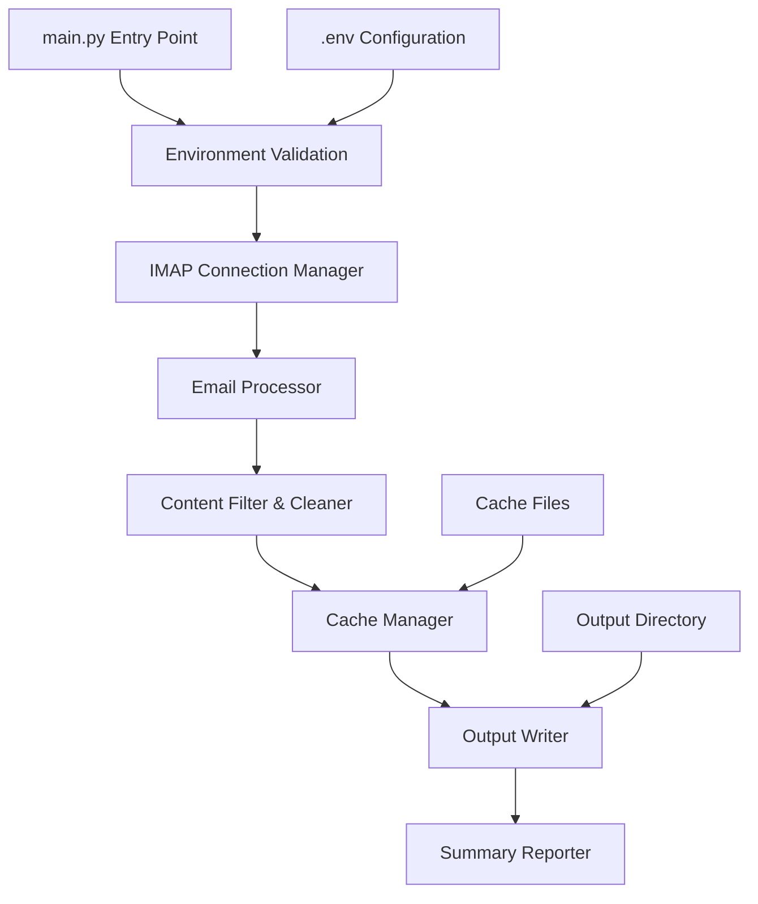

# Design Document

## Overview

The Email Exporter Script is designed as a single-file Python application that provides a streamlined solution for extracting and processing sent emails from Gmail, iCloud, or Outlook accounts. The architecture emphasizes simplicity, reliability, and maintainability while handling the complexities of IMAP communication, HTML parsing, content filtering, and caching.

The system follows a modular functional design within a single file, making it easy to deploy and maintain while providing clear separation of concerns through well-defined functions.

## Architecture

### High-Level Architecture



### Core Components

1. **Configuration Manager** - Handles environment variable validation and provider-specific settings
2. **IMAP Connection Manager** - Manages secure connections with retry logic
3. **Email Processor** - Orchestrates the email fetching and processing pipeline
4. **Content Filter & Cleaner** - Handles HTML parsing, reply stripping, and content validation
5. **Cache Manager** - Manages UID caching for duplicate prevention
6. **Output Writer** - Handles file creation and content writing
7. **Summary Reporter** - Provides progress logging and final statistics

## Components and Interfaces

### Configuration Manager

```python
class EmailExporterConfig:
    """Handles configuration validation and provider-specific settings"""
    
    def __init__(self):
        self.provider: str
        self.email_address: str
        self.app_password: str
        self.imap_server: str
        self.sent_folder: str
    
    def validate_environment(self) -> None
    def get_imap_settings(self) -> tuple[str, str]
```

**Provider-Specific Settings:**
- Gmail: `imap.gmail.com:993`, folder `[Gmail]/Sent Mail`
- iCloud: `imap.mail.me.com:993`, folder `Sent Messages`
- Outlook: `outlook.office365.com:993`, folder `Sent Items`

### IMAP Connection Manager

```python
class IMAPConnectionManager:
    """Manages IMAP connections with retry logic and error handling"""
    
    def __init__(self, config: EmailExporterConfig):
        self.config = config
        self.connection: imaplib.IMAP4_SSL
        self.max_retries = 3
    
    def connect(self) -> bool
    def disconnect(self) -> None
    def select_sent_folder(self) -> None
    def fetch_message_uids(self, batch_size: int = 500) -> Iterator[List[str]]
    def fetch_message(self, uid: str) -> email.message.Message
```

### Content Filter & Cleaner

```python
class ContentProcessor:
    """Handles email content extraction, cleaning, and filtering"""
    
    def extract_body_content(self, message: email.message.Message) -> str
    def convert_html_to_text(self, html_content: str) -> str
    def strip_quoted_replies(self, content: str) -> str
    def normalize_whitespace(self, content: str) -> str
    def is_valid_content(self, content: str) -> bool
    def is_system_generated(self, message: email.message.Message) -> bool
```

**Content Processing Pipeline:**
1. Extract body from email message (HTML or plain text)
2. Convert HTML to plain text using html2text
3. Strip quoted replies using regex patterns
4. Normalize whitespace and line breaks
5. Validate content length (minimum 20 words)
6. Check for system-generated patterns

### Cache Manager

```python
class CacheManager:
    """Manages UID caching for duplicate prevention"""
    
    def __init__(self, provider: str, output_dir: str):
        self.cache_file: str
        self.processed_uids: Set[str]
    
    def load_cache(self) -> None
    def save_cache(self) -> None
    def is_processed(self, uid: str) -> bool
    def mark_processed(self, uid: str) -> None
```

**Cache File Structure:**
```json
{
    "processed_uids": ["uid1", "uid2", "uid3"],
    "last_updated": "2024-01-15T10:30:00Z",
    "total_processed": 150
}
```

### Output Writer

```python
class OutputWriter:
    """Handles file creation and content writing"""
    
    def __init__(self, provider: str, output_dir: str):
        self.output_file: str
        self.output_dir: str
    
    def create_output_file(self) -> None
    def write_content(self, content: str, message_id: str) -> None
    def finalize_output(self) -> None
```

**Output File Format:**
```
=== EMAIL 1 ===
[Cleaned email content here]

=== EMAIL 2 ===
[Cleaned email content here]
```

## Data Models

### Email Processing Statistics

```python
@dataclass
class ProcessingStats:
    total_fetched: int = 0
    skipped_short: int = 0
    skipped_duplicate: int = 0
    skipped_system: int = 0
    retained: int = 0
    errors: int = 0
    
    def get_summary(self) -> str
```

### Configuration Data

```python
@dataclass
class ProviderConfig:
    imap_server: str
    port: int
    sent_folder: str
    
PROVIDER_CONFIGS = {
    'gmail': ProviderConfig('imap.gmail.com', 993, '[Gmail]/Sent Mail'),
    'icloud': ProviderConfig('imap.mail.me.com', 993, 'Sent Messages'),
    'outlook': ProviderConfig('outlook.office365.com', 993, 'Sent Items')
}
```

## Error Handling

### Connection Errors
- **IMAP Connection Failures**: Retry up to 3 times with exponential backoff (1s, 2s, 4s)
- **Authentication Errors**: Immediate failure with clear error message
- **Network Timeouts**: Retry current batch once, then continue with next batch

### Processing Errors
- **Individual Message Failures**: Log error, increment error counter, continue processing
- **HTML Parsing Errors**: Fall back to plain text extraction
- **Cache File Corruption**: Create new cache file, log warning

### File System Errors
- **Output Directory Creation**: Create directory if missing, fail if permissions insufficient
- **File Write Errors**: Immediate failure with clear error message
- **Cache Write Errors**: Log warning, continue without caching

### Error Recovery Strategy

```python
def with_retry(func, max_retries=3, backoff_factor=1):
    """Generic retry decorator with exponential backoff"""
    for attempt in range(max_retries):
        try:
            return func()
        except Exception as e:
            if attempt == max_retries - 1:
                raise
            time.sleep(backoff_factor * (2 ** attempt))
```

## Testing Strategy

### Unit Testing Approach

**Configuration Testing:**
- Validate environment variable parsing
- Test provider-specific configuration loading
- Verify error handling for missing variables

**Content Processing Testing:**
- Test HTML to text conversion with various HTML structures
- Validate quoted reply stripping with different email clients
- Test word count validation and system message detection
- Verify whitespace normalization

**Cache Management Testing:**
- Test cache file creation and loading
- Validate UID tracking and duplicate detection
- Test cache corruption recovery

**IMAP Connection Testing:**
- Mock IMAP connections for unit tests
- Test retry logic with simulated failures
- Validate folder selection for different providers

### Integration Testing

**End-to-End Testing:**
- Use test email accounts with known sent messages
- Validate complete processing pipeline
- Verify output file format and content quality

**Error Scenario Testing:**
- Test with invalid credentials
- Simulate network interruptions
- Test with corrupted cache files
- Validate behavior with empty sent folders

### Performance Testing

**Large Mailbox Testing:**
- Test with mailboxes containing 1000+ messages
- Validate memory usage during batch processing
- Test pagination and batch processing efficiency

**Content Processing Performance:**
- Test with large HTML emails (>100KB)
- Validate processing time for complex nested replies
- Test deduplication performance with large datasets

## Dependencies

### Required Python Libraries

```python
# Standard Library
import imaplib
import email
import os
import json
import datetime
import re
import time
from typing import Iterator, List, Set, Optional
from dataclasses import dataclass

# Third-party Libraries
from bs4 import BeautifulSoup  # HTML parsing
import html2text  # HTML to text conversion
from dotenv import load_dotenv  # Environment variable loading
```

### Installation Requirements

```bash
pip install beautifulsoup4 html2text python-dotenv
```

## Security Considerations

### Credential Management
- App-specific passwords stored in `.env` file (not committed to version control)
- No credential caching or persistence beyond environment variables
- IMAP connections use SSL/TLS encryption

### Data Privacy
- No email metadata stored in output files
- Cache files contain only UIDs, not content
- Output files contain only user-authored content

### File System Security
- Output directory created with standard permissions
- No temporary file creation for sensitive data
- Cache files use JSON format for transparency

## Performance Considerations

### Memory Management
- Batch processing (500 messages per batch) to prevent memory overflow
- Individual message processing to minimize memory footprint
- Cache data loaded once at startup, updated incrementally

### Network Efficiency
- IMAP connection reuse throughout processing
- Batch UID fetching to minimize round trips
- Graceful handling of network timeouts

### Processing Optimization
- Early filtering to skip system messages
- Content deduplication using hash comparison
- Efficient regex patterns for reply stripping